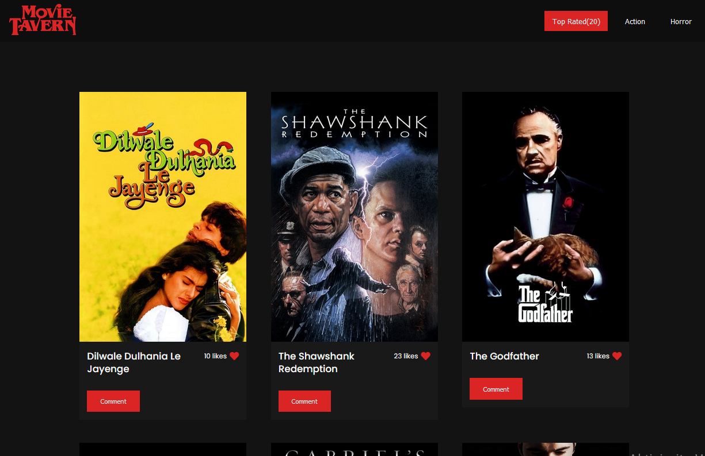

# Movie App Project

> This is Movie App.



Here you can search for movies.

## Setup

### Clone this repository

```bash
$ git clone https://github.com/mugberto/capstone-api-based-web.git
$ cd capstone-api-based-web
```

### Run project

```bash
$ npm install
$ npm start
```
### Open page in browser
```bash
$ open dist/index.html
```
## Built With

- HTML
- CSS
- JS
- Webpack

## Live Demo

Live will be soon.

## Authors

👤 **Vladan Videnović**

- GitHub: [@githubhandle](https://github.com/vladanvi99)
- Twitter: [@twitterhandle](https://twitter.com/vladanvi99)
- LinkedIn: [LinkedIn](https://www.linkedin.com/in/vladan-videnovi%C4%87-780bb11b2/)

**Hubert MUGABO**

- Github: [@mugberto](https://github.com/mugberto)
- Twitter: [@mugberto](https://twitter.com/mugberto)
- Linkedin: [mugberto](https://www.linkedin.com/in/hubert-mugabo-23144b6a/)

## 🤝 Contributing

Contributions, issues, and feature requests are welcome!

Feel free to check the [issues page](../../issues/).

## Show your support

Give a ⭐️ if you like this project!


